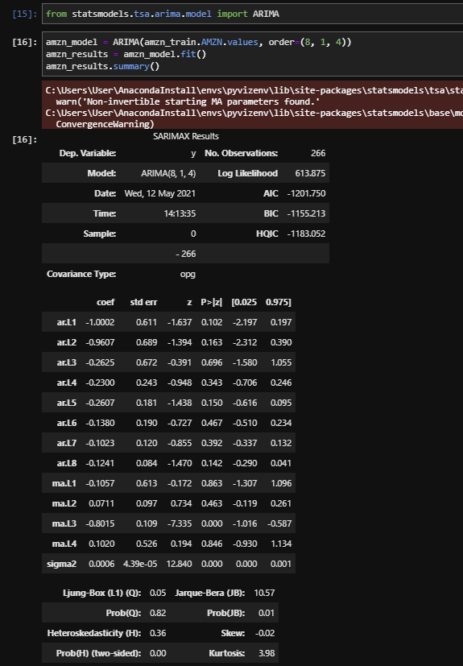
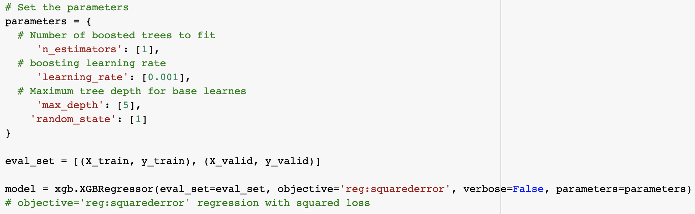
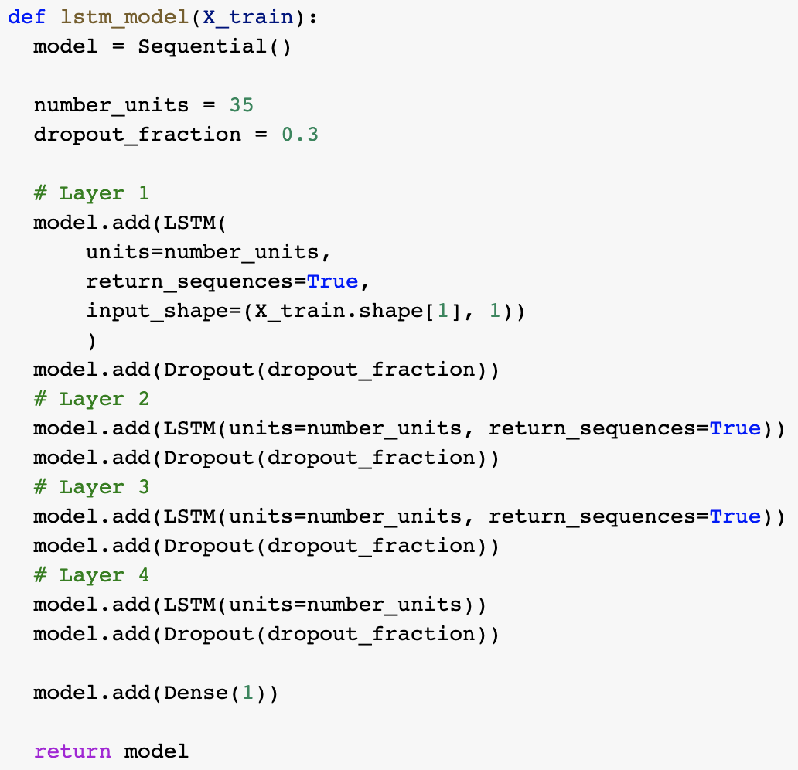

# Optimal Asset Forecasting 

The purpose of these notebooks is to test various machine learning predictive models on two sets of asset buckets: Tech stocks and Cryptocurrency. The code uses closing prices pulled from Alpaca API and CoinAPI and converted to CSV files for stocks and crypto assets respectively. The notebooks use the past 15 months of data considering highly volatile market to capture post COVID-19 shock across all models for optimal predictions. As the data in this study is of time series nature, we have used ARIMA, XGBoost, and LSTM models since they are time series friendly.

  

---

## Technologies

**Language:** Python3, Pandas 

**ARIMA Requirements**:  
numpy, pandas, math, matplotlib inline, Path from pathlib, plot_acf and plot_pacf from statsmodels.graphics.tsaplots, ARIMA from statsmodels.tsa.arima.model, metrics from sklearn

**XGBoost Requirements:**  
numpy, pandas, xgboost, train_test_split from sklearn.model_selection, GridSearchCV, matplotlib.pyplot, plot_importance from xgboost , plot_tree, mean_squared_error from sklearn.metrics, MinMaxScaler from sklearn.preprocessing 

**LSTM Requirements:**  
numpy, pandas, math, hvplot.pandas, Path from pathlib, seed from numpy.random, random from tensorflow, MinMaxScaler from sklearn.preprocessing, Sequential from tensorflow.keras.models and LSTM, Dense, Dropout from tensorflow.keras.layers

**External Resources:**  
BTC_data.csv, ETH_data.csv, LTC_data.csv,  AMZN_GOOG_MSFT_data.csv pulled from Alpaca API and CoinAPI

*Developed with Google Colab* - [Using Google Colab](https://colab.research.google.com/notebooks/intro.ipynb?utm_source=scs-index)   
  

---

## Usage

**ARIMA:**
- *Set up:*
    1. Read in closing price data  
    2. Calculate percent changes from daily returns  
- *Usage:*
    1. Specify desired date range  
    2. Split date ranges into train and test split ratio  
    3. Run PACF and ACF to help determine parameters  
    4. Optimize parameters to improve performance  
    5. Convert predicted percent change returns back to price predictions  

**XGBoost:**
- *Set up:*
    1. Read in closing price data   
    2. Calculate financial indicators and added to the closing price data frame   
- *Usage:*
    1. Specify the train, validate, test split ratio   
    2. Set the parameters   
    3. Option to change the parameters and/or the split ratio to improve performance   

**LSTM:**
- *Set Up:*
    1. Read in closing price data   
    2. Create a dataframe for each set of closing price data   
    3. Create a list of all dataframes to be run in the model   
- *Usage:*
    1. Specify number of units and dropout fraction for the model   
    2. Remove or add layers to model as necessary for performance   
    3. If using window_data function, specify window size   
    4. Select dates to slice the data if necessary   
    5. Specify train/test split ratio   
    6. Option to change model optimizer to improve performance   
    7. Specify number of epochs and batch size to optimize   
  

---

## Examples

**ARIMA model example:**

**XGBoost model example:**

**LSTM model example:**

  

---

## Contributors

Drew Disbrow Marnell: dldmarnell@gmail.com   
Yoko Yamamoto: yyamamo222@gmail.com   
Apexa Patel: apexa.dhirubhai@gmail.com   
Matt Epler: epler.matt@gmail.com   
  

---

## License

MIT License
Copyright (c) 2021 Drew Disbrow Marnell